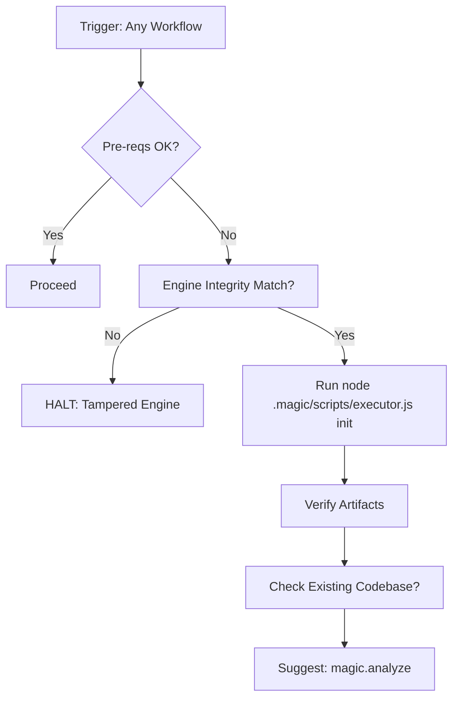

# Init Workflow

Silent pre-flight check for `.design/` setup. Auto-called by Step 0 of all workflows.

## Core Invariants (Mandatory)

1. **Context (Zero-Prompt)**: Auto-resolve workspace: explicit CLI arg > `MAGIC_WORKSPACE` env var > `.design/workspace.json` `default` field > single-workspace auto-select > root `.design/` fallback. If multiple workspaces and no default → ask user. Never ask otherwise.
2. **Engine Integrity**: HALT if `check-prerequisites --json` returns integrity warnings (Checksums/Ghost Registry).
3. **Silent Default**: Run autonomously. Report only brief status or fatal failure.
4. **Non-Overwriting**: Skips existing files. Never mutates user state.
5. **Versioning (C14)**:
    - **Engine Integrity (C14)**: If engine files (`.magic/`) modified → `node .magic/scripts/executor.js update-engine-meta --workflow init` (Smart History: redundant automated entries are skipped).
    - **Rules**: Initial `RULES.md` is versioned at 1.0.0.

## Workflow: Setup & Verification



### Steps

1. **Check**: `node .magic/scripts/executor.js check-prerequisites --json`.
    - If `ok: true` → Skip silently. Return control to calling workflow.
    - If `ok: false` & contains `ENGINE_INTEGRITY` or `GHOST_REGISTRY` warnings → **HALT**. Report: "Engine integrity failure: {warning_type}. Run `node .magic/scripts/executor.js update-engine-meta` or restore from origin."
    - If `ok: false` & missing system files (no integrity warnings) → proceed to Step 2 (Init).
    - If `ok: false` & reason is unrecognized → **HALT**. Report: "Unexpected pre-flight failure: {raw output}. Investigate manually."
2. **Init**: `node .magic/scripts/executor.js init`.
    - Creates: `INDEX.md`, `RULES.md`, `specifications/`, `tasks/`, `archives/tasks/`.
3. **Verify**: Ensure all 5 artifacts exist. HALT on failure.
4. **Hint**: If `package.json`, `pyproject.toml`, `src/`, or `lib/` detected AND `INDEX.md` is empty/new → Suggest: *"Analyze project"*.

### Structure Created

```
.design/
├── INDEX.md (Registry)
├── RULES.md (Conventions C1-C22)
├── workspace.json (Context)
├── specifications/
├── tasks/
└── archives/tasks/
```

## Init Completion Checklist

```
Init Checklist
  ☐ .design/ structure, registry, and workspace.json validated
  ☐ Engine integrity verified (no checksum mismatch)
  ☐ RULES.md (C1-C22) & INDEX.md headers present; Smart History verified
  ☐ Existing codebase check performed; analyzer suggested if applicable
```
