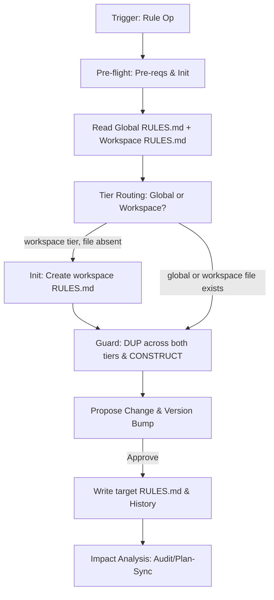

# Rule Workflow

Manages project conventions across a two-tier rules system:

- **Global**: `.design/RULES.md` — Universal Constitution (§1–6) + cross-workspace §7 conventions.
- **Workspace**: `.design/{workspace}/RULES.md` — workspace-local §7 conventions only; inherits global, never overrides §1–6.

## Core Invariants (Mandatory)

1. **Context (Zero-Prompt)**: Auto-resolve workspace: explicit CLI arg > `MAGIC_WORKSPACE` env var > `.design/workspace.json` `default` field > single-workspace auto-select > root `.design/` fallback. If multiple workspaces and no default → ask user. Never ask otherwise. After resolution, load global `RULES.md` first, then workspace `RULES.md` if it exists.
2. **Scope Guard**: Only modify §7. Sections 1-6 are the **Universal Constitution**; amend ONLY if explicitly targeted by user.
3. **No Silent Writes**: Always show proposed diff/statement before committing.
4. **Auto-Init**: If `.design/` missing, auto-run `.magic/init.md`. If workspace RULES.md is needed but absent, auto-create from template (see Init action) before writing.
5. **Versioning (C14)**:
    - **Engine Integrity (C14)**: If engine files (`.magic/`) modified → `node .magic/scripts/executor.js update-engine-meta --workflow rule` (Smart History: redundant automated entries are skipped).
    - **Rules**: Bump Minor (add/amend), Major (remove), or Patch (typos). Update Document History in the target file (global or workspace). Modifying `.design/{workspace}/RULES.md` does NOT trigger a C14 engine bump (per C14§3 — `.design/` modifications are project manifest bumps, not engine bumps).

## Rule Tier Routing

When processing an add/amend/remove request, determine the target tier:

- **Workspace tier** → `.design/{workspace}/RULES.md`: rule explicitly names a workspace, references workspace-scoped paths/tools, or applies only to one workspace's domain. Signal words: *"in engine"*, *"for installers"*, *"this workspace"*.
- **Global tier** → `.design/RULES.md`: rule applies uniformly regardless of which workspace is active, or no workspace is active.
- **Ambiguous**: Ask user — "Should this rule be global (all workspaces) or scoped to `{workspace}` only?"

## Workflow: Convention Management



### Operational Logic

1. **Pre-flight**: `node .magic/scripts/executor.js check-prerequisites --json`.
    - `ok: true` → proceed.
    - `checksums_mismatch` → **HALT**. Report: "Engine integrity failure. Run `update-engine-meta` or restore from origin."
    - Missing `.design/` → auto-run `.magic/init.md`, then resume.
2. **Read**: Load global `.design/RULES.md`. If workspace is active and `.design/{workspace}/RULES.md` exists, load it too. Parse user intent into a declarative statement.
3. **Tier Routing**: Apply Rule Tier Routing logic to determine target file.
4. **Guards**:
    - **Core-Amendment Routing**: If the user's target matches a section in §1–6 (not §7) → route as a **core amendment**. Inform: "This targets core section §{N}. Core amendments require explicit approval and trigger a Major version bump." Require user confirmation before proceeding. If confirmed → apply change to the target core section. If denied → abort.
    - **Constitutional**: If a new §7 rule contradicts §1-6 core → **HALT** & report.
    - **Duplication**: If semantically overlaps with any C{N} in EITHER global or workspace RULES.md → Propose merge/replace.
5. **Propose**: Show "Current vs Proposed" side-by-side. State target tier and version impact (e.g., workspace RULES.md 1.0.0 → 1.1.0).
    - **Batch**: When the user requests multiple rule changes (add + amend, or multiple adds), group all changes into a single proposal with one "Apply all?" confirmation and one version bump.

### Actions

| Action | Logic | Version |
| :--- | :--- | :--- |
| **Add** | Global: find highest C{N} → append after it in §7. Workspace: find highest WC{N} in `## Workspace Conventions` → append there; if none exist yet, start at WC1. | Minor |
| **Amend** | Match ID/Keyword in target tier → Replace in place. | Minor |
| **Remove** | Match ID/Keyword in target tier → **Dependency Scan** (see below) → Delete entry. | Major |
| **List** | Display all §7 entries from global RULES.md; if workspace RULES.md exists, display its conventions separately. | N/A |
| **Init** | Create `.design/{workspace}/RULES.md` from template if absent. Called automatically before first workspace-tier Add. | N/A |

**Remove — Dependency Scan**: Before proposing deletion, scan all `.magic/*.md` workflow files and `.design/` spec files for references to the target convention ID (e.g., `C3`, `WC1`). If references found → include in the Propose step (§5): "Convention `{ID}` is referenced by: [{file}: {context}]. Removing it may break workflow logic or spec compliance." The user sees this in the single "Current vs Proposed" approval — no additional confirmation gate. After removal, references become the user's responsibility to update.

**Workspace RULES.md template** (used by Init action):

```
# {Workspace} Specification Rules

**Workspace:** {workspace}
**Inherits:** [../RULES.md](../RULES.md)
**Version:** 1.0.0
**Status:** Active

## Overview

Workspace-local conventions for `{workspace}`. Supplements (never overrides) the global constitution in `.design/RULES.md`. Sections §1–6 apply universally.

## Workspace Conventions

## Document History

| Version | Date | Author | Description |
| :--- | :--- | :--- | :--- |
| 1.0.0 | {date} | Agent | Initial workspace rules file. |
```

### Post-Write: Impact Analysis & Sync

After writing, check for TASKS.md in the active workspace (`.design/{workspace}/TASKS.md`) or globally (`.design/TASKS.md`). If found:

- **Notify**: Inform user that `TASKS.md` version (`Based on RULES`) is now stale.
- **Offer Sync**: Propose running `magic.task update` to propagate the rule changes into the active plan.
- **Audit**: If rule is critical (L1/C1-C10 or WC1), suggest `magic.spec audit` for compliance.

## Rule Completion Checklist

```
Rule Checklist — {operation}
  ☐ Read full RULES.md (global + workspace if active); §1-6 core invariants respected
  ☐ Tier routing: target file confirmed (global RULES.md or workspace RULES.md)
  ☐ Scope: only §7 target (unless core amendment requested)
  ☐ Guards: no semantic duplication across both tiers; no core contradiction
  ☐ Version bumped (Major/Minor/Patch); Document History updated in target file
  ☐ Rules Parity: User notified if TASKS.md requires update/sync
  ☐ Engine Meta: C14 bump ONLY if .magic/ files modified (not for .design/ changes)
```
