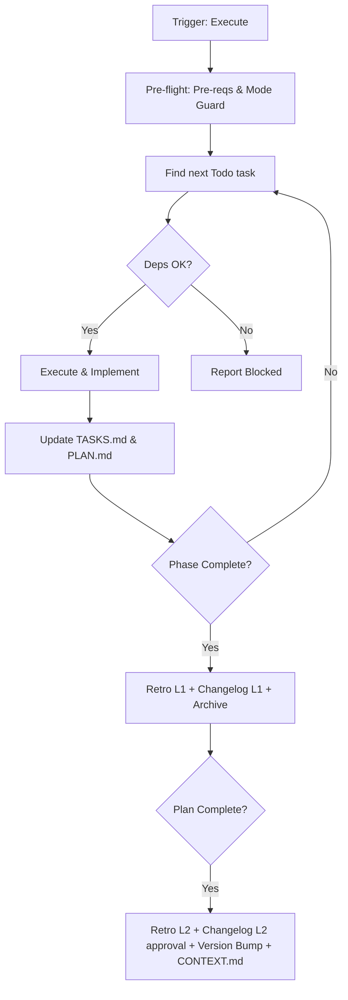

# Run Workflow

Executes `TASKS.md` atomic tasks. Input: `.design/TASKS.md`.

## Argument Routing

Parse the `[arg]` to determine the execution mode:

| Input | Detection | Result |
| :--- | :--- | :--- |
| *(empty)* | No argument | **Full Execution**: Resolve workspace via §Workspace Resolution, then execute next available `Todo` task(s) |
| `engine` | Matches a workspace name in `workspace.json` | **Scoped Execution**: Execute tasks only from that workspace's `TASKS.md` |
| `"T-1A01"` | Quoted text or non-workspace token matching `T-XXXX` pattern | **Targeted Task**: Execute a specific task by ID |
| `"phase-2"` | Quoted text or non-workspace token matching `phase-N` pattern | **Targeted Phase**: Execute all `Todo` tasks in the specified phase |
| `"только тесты"` | Quoted text or non-workspace token (general directive) | **Directed Execution**: Interpret text as execution filter or focus |
| `engine "phase-1"` | First token is workspace + remaining is quoted text | **Scoped + Directed**: Execution directive applied within workspace scope |

> **Workspace Fallback (Modes A, C)**: When no workspace is specified in the argument, resolve workspace via Core Invariant #1 (Zero-Prompt chain) before applying the execution directive. The directive text filters or targets execution but does not replace workspace resolution.
> **Disambiguation**: If the argument is a single unquoted word that matches both a workspace name and could be a directive keyword, workspace takes priority. To force directive interpretation, wrap in quotes: `/magic.run "engine"`.
> **Handoff Propagation**: When recommending `/magic.task` for re-planning, propagate the workspace context: `/magic.task {workspace}`.

## Core Invariants (Mandatory)

1. **Context (Zero-Prompt)**: Auto-resolve workspace: explicit CLI arg > `MAGIC_WORKSPACE` env var > `.design/workspace.json` `default` field > single-workspace auto-select > root `.design/` fallback. If multiple workspaces and no default → ask user. Never ask otherwise.
2. **Rules First**: Read `RULES.md` before any code edit. Adhere to project conventions.
3. **Auto-Init**: If `.design/` missing, auto-run `.magic/init.md`.
4. **Logic Guards**:
    - **Dependency**: Never start a task if parents are not `Done`.
    - **Mode**: Sequential or Parallel must be in `RULES.md §7`. If missing → **HALT**.
    - **Sync**: If `RULES.md` version > `TASKS.md` base → Warn user of drift. Hint: run `magic.task update` to sync and re-verify tasks.
    - **Quarantine (C12)**: If any active task belongs to a specification whose L1 parent is not Stable (C12 Quarantine) → **HALT**. Force re-run of `magic.task` to move tasks to quarantine/backlog.
    - **Spec Stability**: Before executing each task, verify its target spec is still `Stable` in `INDEX.md`. If demoted (`Stable`→`RFC` or `Draft`) since plan generation → **HALT**. Report: "Spec `{file}` is no longer `Stable`. Run `magic.task update` to re-evaluate the plan." This catches external status changes that C12 pre-flight alone cannot detect.
    - **Phantom Spec**: If a specification referenced by `TASKS.md` is missing from `INDEX.md` or the physical filesystem → **HALT**. Report: "Phantom Spec `{file}` detected. 💡 Hint: run `magic.spec --audit` or `magic.analyze` to resolve the discrepancy."
5. **Zero-Prompt Automation**: Skip all confirmations (track selection, changelog, retro). Execute sequences autonomously.
6. **Engine Integrity (C14)**: If engine files (`.magic/`) modified → `node .magic/scripts/executor.js update-engine-meta --workflow run` (Smart History: redundant automated entries are skipped).

## Execution Setup

| Mode | Role | Process |
| :--- | :--- | :--- |
| **Sequential** | Mono-Agent | Picks next `Todo` → Executes → Updates `Done` → Repeats. |
| **Parallel** | Manager | Reads `TASKS.md` → Reads associated spec sections for each task → Detects shared-file conflicts (including constraints only visible in spec body) → Assigns tracks → Syncs `PLAN.md`. Re-reads `INDEX.md` spec statuses before each new task assignment to detect mid-run spec demotions from other workflow contexts. |
| **Parallel** | Developer | Track owner (mono or sub-agent) → Executes in order → Reports `Done/Blocked` → Wait for next assignment. |

*Parallel Constraint*: serialize tasks modifying the same file to prevent race conditions.

## Workflow: Task Execution



### Steps

1. **Pre-flight**: `node .magic/scripts/executor.js check-prerequisites --json --require-tasks`.
    - **Spec Stability Spot-Check**: Read `INDEX.md`. For each spec referenced by a `Todo` task in the current phase, confirm status = `Stable`. Any non-Stable spec → **HALT** before execution begins (see Logic Guard above).
    - **File-Header Parity**: For each spec referenced by a `Todo` task in the current phase, read the actual file's `Status:` and `Version:` header fields. If either mismatches the corresponding `INDEX.md` entry → **HALT** with `STATUS_DRIFT` or `VERSION_DRIFT`. Report: "Header parity failure on `{file}`: file {field} `{file_val}` ≠ registry `{index_val}`. Resolve via `magic.spec` or `magic.analyze` before execution." This catches manual edits that bypassed the spec workflow.
2. **Select**: Locate `Todo` task with fulfilled dependencies.
    - *Stalled*: If 0 `Todo` but `Blocked` exist → **HALT** & report.
3. **Execute**: Implement per spec section. No scope creep.
4. **Update**:
    - **Mid-Run Stability Check**: Before committing any task as `Done`, re-verify its target spec is still `Stable` in `INDEX.md` **and** confirm the file header `Status:` matches `INDEX.md`. If either source shows demotion or drift since dispatch → **HALT** that track. Report: "Spec `{file}` demoted to `{status}` during execution of `{task}`. Task output suspended — run `magic.task update` to re-evaluate." In Parallel mode, the Developer track must notify the Manager role of the suspension so the Manager can halt further assignments for the affected spec.
    - Set `In Progress` → `Done` (or `Blocked [!]` with reason) in **`TASKS.md` Phase Checklist**.
    - **Handoff**: If spec is ambiguous → **HALT**. Trigger `magic.spec` update. After the spec is updated, return to `magic.task update` to rebuild dependencies and re-verify task validity before resuming execution.
    - **Sync**: If spec/phase finished → Update high-level `[x]` in `PLAN.md`.
    - **Actionable Outcome**: After phase complete, show: `[Auto-Run] Phase {N} complete. {M} tasks archived.`
    - **Change Record**: Write 1-line summary in task `Changes` field in `TASKS.md`.
5. **Phase Completion**:
    - **Retro L1**: Auto-run Level 1 (snapshot). HALT on failure.
    - **Changelog L1**: Append `## Phase {N} — {date}` + bullet list (extracted from **Done** task `Changes` fields) to `CHANGELOG.md`.

### Plan Completion (Succession Loop)

1. **Retro L2**: Auto-run Level 2 (Full).
2. **Changelog L2**: Present compiled release entry. **Only manual step: Yes/No approval.**
3. **Version Bump**: Bump manifests (`package.json`, `pyproject.toml`, etc.) per changelog (Major/Minor/Patch).
4. **Finalize**: Regenerate `CONTEXT.md`.

## Run Completion Checklist

```
Checklist — {operation}
  ☐ Spec Stability: All active-phase specs confirmed Stable in INDEX.md before execution
  ☐ Rules Parity: Current RULES.md version matches TASKS.md base; no drift warnings ignored
  ☐ TASKS.md read first; execution bound to spec section
  ☐ Parallel: Manager role enforced; shared files serialized
  ☐ Status: TASKS.md Checklist / phase files / PLAN.md [x] synced
  ☐ Blockers: All Blocked tasks have Notes explaining [!] handoff
  ☐ Conclusion: Retro L1/L2 shot, Changelog L1/L2 written, manifest bumped, CONTEXT.md updated
```
