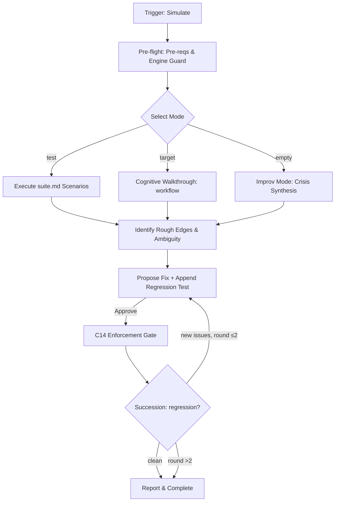

# Simulation Workflow

Debugs engine logic via synthetic "war games". Focus: logic gaps, friction, and AOP.

## Core Invariants (Mandatory)

1. **Context (Zero-Prompt)**: Auto-resolve workspace: explicit CLI arg > `MAGIC_WORKSPACE` env var > `.design/workspace.json` `default` field > single-workspace auto-select > root `.design/` fallback. If multiple workspaces and no default → ask user. Never ask otherwise.
2. **Cognitive Execution ONLY**: **GUARD**: Never write/run physical simulation scripts. Evaluate logic internally (LLM task) and report expected outcomes.
3. **Surgical Fix & Test**: If friction found → Propose fix (exact lines) + write new regression test in `.magic/tests/suite.md`. Show to user for Yes/No (C1).
4. **Engine Integrity (C14)**: If engine files (`.magic/`) modified → `node .magic/scripts/executor.js update-engine-meta --workflow simulate` (Smart History: redundant automated entries are skipped).
5. **No Metrics**: Real-world history/logs are for `retrospective.md`.

## Workflow: Validation & Stress-Testing



### 0. Pre-flight (Mandatory — All Modes)

1. Run `node .magic/scripts/executor.js check-prerequisites --json`.
    - `ok: true` → proceed to Mode Selection.
    - `checksums_mismatch` or `ENGINE_INTEGRITY` → **HALT**. Report: "Engine integrity failure — resolve before simulating. Hint: run `node .magic/scripts/executor.js update-engine-meta --workflow {mismatched_workflow}` to sync checksums, or restore files from origin." Do NOT fall through to any mode.
    - Missing `.design/` → auto-run `.magic/init.md`, then resume.
2. Read `.design/workspace.json` → resolve active workspace(s) per Context invariant.
3. Read target workflow file(s) that will be evaluated (determined by mode in Step 1).

### 1. Mode Selection

- **Test Suite**: `/magic.simulate test`. Runs all scenarios in `.magic/tests/suite.md`. If missing: fallback to Improv Mode automatically; notify user with hint to restore the file from origin.
- **Direct**: `/magic.simulate {workflow}` or `/magic.simulate {workflow} {mode}` (e.g., `/magic.simulate spec analyze`). Targets specific logic or sub-modes. Also accepts file paths (e.g., `@/path/to/workflow.md`) — extract the workflow name from the filename.
- **Improv**: Default if 0 args. Synthesize a crisis scenario following the **Crisis Template** (see below) and perform a **Cognitive Walkthrough** of the full SDD chain (Spec→Task→Run) on this imaginary state to find leaks.

### 1a. Crisis Template (Improv Mode Only)

Every synthesized crisis **must** satisfy all of the following structural requirements. If a requirement cannot be met (e.g., single-workspace project), document why it is skipped.

| # | Requirement | Minimum |
| :--- | :--- | :--- |
| CR-1 | **Workflows affected** | ≥2 distinct workflows from {spec, task, run, analyze, rule, init} |
| CR-2 | **Full chain walkthrough** | Trace the crisis through Spec→Task→Run in sequence; do not skip a link |
| CR-3 | **Cross-workspace scope** | If `workspace.json` has >1 workspace, crisis must span ≥2 workspaces |
| CR-4 | **Guard stress** | Crisis must attempt to bypass ≥3 distinct guards (C1–C22) |
| CR-5 | **Drift vector** | Include ≥1 out-of-band mutation (manual file edit, external tool, or missing file) |
| CR-6 | **Named scenario** | Assign a short descriptive name (e.g., "The Phantom Cascade") for traceability |

**Output format** (present before walkthrough):

```
Crisis: "{CR-6 name}"
  Affected workflows: {CR-1 list}
  Chain: Spec → Task → Run (CR-2)
  Workspaces: {CR-3 list or "single-workspace — CR-3 skipped"}
  Guards targeted: {CR-4 list of C{N} IDs}
  Drift vector: {CR-5 description}
```

### 2. Logic Audit & AOP

Scan the target workflow(s) for:

- **Instruction Density**: Bloat vs Precision (see metric definition in §3).
- **Ambiguity**: Instructions that different LLMs would interpret differently. Flag any conditional without an explicit outcome for both branches (e.g., "if X → HALT" but no "else → proceed").
- **Context Economy**: Token waste in redundant `read_file` calls or repeated context loading.
- **Broken Loops**: Checklists that don't cover the work; steps referenced in diagrams but missing from text.
- **Suite Integrity** (**trigger: `test` and `improv` modes only; skip in `direct` mode**): Verify `.magic/tests/suite.md` follows structural requirements:
  - Each test uses `### T{N} — {Title}` (H3, sequential ID, dash-separated title).
  - Required fields: `- **Workflow:**`, `- **Synthetic State:**`, `- **Action:**` or `- **Test {X}:**`, `- **Expected:**` (with `[ ]` checkboxes), `- **Guards tested:**`.
  - No duplicate test IDs. Finalization footer matches actual last ID.
  - **Timing**: In `test` mode — run Suite Integrity **before** executing scenarios (malformed tests produce unreliable results). In `improv` mode — run **after** appending new tests (validate own output).

### 3. Reporting & Fixes

- **Individual Audit**: Table with `Dimension | Finding | Outcome (PASS/FAIL/ROUGH EDGE)`.
- **Cognitive Coverage Report**:
  - **Instruction Density** (1-10): Score = `10 - (vague_count + dup_count)`. Minimum 1.
    - **Vague term** (closed list): any of these unquantified qualifiers found in workflow instructions: `"many"`, `"often"`, `"significant"`, `"several"`, `"various"`, `"usually"`, `"mostly"`, `"reasonable"`, `"appropriate"`, `"high-confidence"`, `"crystal clear"`, `"strong/weak tier"`, `"minimal"`, `"substantial"`. Count each unique occurrence per file (not per line).
    - **Duplicate**: same guard or logic rule stated **verbatim or near-verbatim** in two different `.md` files within `.magic/` (e.g., C14 phrasing in both `spec.md` and `run.md`). Intentional invariant reinforcement (same rule restated in each workflow's "Core Invariants" header) counts as **1 duplicate total** regardless of how many files repeat it — this is by design. Count as duplicate only when the **body text diverges** between copies (sync risk).
  - **Guard Resilience** (1-10): Score = `Guards_Triggered / Guards_Expected × 10`. Classify each guard before testing:
    - **Mechanical guard**: Enforced by `executor.js` or filesystem checks (e.g., `check-prerequisites` catches `checksums_mismatch`). Test: would the script output block the workflow? Score: PASS if yes.
    - **Instructional guard**: Enforced only by LLM instruction text (e.g., C7 "Direct calls to `.sh` not permitted"). Test: does the workflow text contain an explicit **HALT** keyword with a concrete condition? Score: PASS if the HALT condition is unambiguous and testable. Score: PARTIAL if the instruction exists but has no HALT and relies on LLM compliance alone.
    - Report both categories separately: `"Mechanical: {X}/{Y}, Instructional: {A}/{B} ({C} partial)"`.
  - **Invariant Compliance** (1-10): Score = `Rules_Followed / Rules_Applicable × 10`. Cross-check workflow steps against all applicable Core Invariants from the target `.md` file.
- **Logic Refinement**: Propose fixes for any `FAIL` or `ROUGH EDGE` outcomes.
- **Surgical Patch**: Apply precisely after approval.
- **C14 Enforcement Gate**: After all patches are applied, verify: were any `.magic/` files modified during this `/magic.simulate` invocation? If yes → run `node .magic/scripts/executor.js update-engine-meta --workflow {modified_workflows}` **immediately**, before reporting results. Do NOT defer to end-of-conversation. This is a blocking step — simulation is not complete until checksums match.
- **Succession**: Run `/magic.simulate test` post-fix to ensure 0 regressions. **Max 2 rounds**: if a second Succession pass still finds new failures, report remaining issues and stop — do not loop indefinitely.
  - **Context Bleed Warning**: The LLM that just wrote fixes has inherent bias toward confirming they work. For high-confidence results, recommend the user start a **new chat session** and run `/magic.simulate test` independently. Always append this note to the final report: `"⚠ Succession ran in-context. For unbiased verification, run /magic.simulate test in a fresh session."`

## Simulation Completion Checklist

```
Simulation Checklist — {target}
  ☐ Pre-flight: check-prerequisites passed (engine integrity, workspace resolved)
  ☐ Cognitive-only guard: No physical scripts written or executed
  ☐ Logic walkthrough: Rough edges or logical gaps identified
  ☐ Cognitive Coverage: Density, Resilience (Mechanical + Instructional), and Compliance metrics reported
  ☐ Suite Integrity: validated (test/improv modes); or skipped (direct mode)
  ☐ C14 Enforcement Gate: checksums regenerated BEFORE reporting (blocking)
  ☐ Succession: ≤2 rounds, 0 regressions on final pass
  ☐ Context Bleed note appended to report
```
