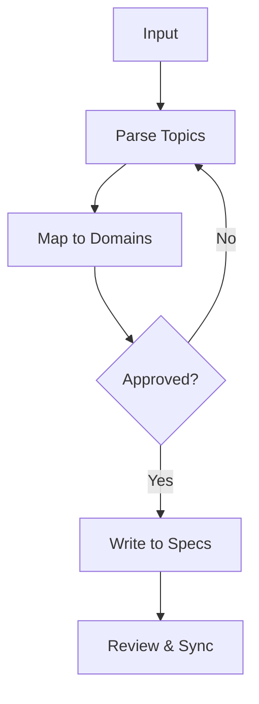

# Specification Workflow

Universal process for managing project specifications in `.design/specifications/`.

> **Scope**: Specification authoring structure and lifecycle. Task phasing is handled by `task.md`.

## Core Invariants (Mandatory)

1. **Context (Zero-Prompt)**: Auto-resolve workspace: explicit CLI arg > `MAGIC_WORKSPACE` env var > `.design/workspace.json` `default` field > single-workspace auto-select > root `.design/` fallback. If multiple workspaces and no default → ask user. Never ask otherwise. (Full resolution table: see `analyze.md` §Workspace Resolution.)
2. **Prohibitions**: No implementation code in specs; use pseudo-code only. If implementation code is detected during any update or creation → **HALT**. No modification of `INDEX.md`, `PLAN.md` or live specs during "Explore/Analyze" modes.
3. **Auto-Init**: If `.design/` or system files missing, auto-run `.magic/init.md`.
4. **Engine Integrity (C14)**: If engine files (`.magic/`) modified → `node .magic/scripts/executor.js update-engine-meta --workflow spec` (Smart History: redundant automated entries are skipped).
5. **Linking**: Every spec must be in `INDEX.md`. Map relations in `Related Specifications`.
6. **Status**: Assign Draft/RFC/Stable/Deprecated. Follow transitions (D->R->S).
7. **Dispatch**: Use "Raw Input" flow for unstructured ideas.
8. **Ventilation**: Use `magic.analyze` to trigger a deep consistency check. See `.magic/analyze.md` Mode C.
9. **Delta-Editing**: For spec files >200 lines, use search-replace instead of full rewrites. Mark changed sections with `[ADDED]`, `[MODIFIED]`, `[REMOVED]`.
10. **Closure**: Every task ends with mandatory "Task Completion Checklist".
11. **Rules**: `RULES.md` is the project constitution. Check before every operation. Apply triggers T1-T4.

## Directory Structure

```plaintext
.design/
├── INDEX.md # Global Registry: aggregates all workspaces
├── RULES.md # Constitution: how project specification is governed
├── workspace.json # Workspace configuration registry
├── main/ # Primary/default workspace
│   ├── INDEX.md # Workspace-specific registry
│   ├── PLAN.md # Implementation plan for main
│   ├── specifications/ # Spec files
│   │   └── *.md
│   ├── TASKS.md # Master task index
│   └── tasks/ # Task files
│       └── phase-{n}.md # Per-phase task files
└── {other-workspaces}/ # Added as needed
```

**System files and their roles:**

| File | Role | Updated by |
| :--- | :--- | :--- |
| `INDEX.md` | Central registry of all spec files | Every create/update |
| `RULES.md` | Project constitution and conventions | Defined triggers |

## Specification Layers

All specifications must declare their layer in the metadata header using `Layer:`.

- **Layer 1 (concept)**: Abstract requirements, business logic, and domain mechanics. Technology-agnostic. Can be ported to any stack.
- **Layer 2 (implementation)**: Concrete realization of a Layer 1 concept in a specific technology stack.
  - Must include an `Implements: {layer-1-file.md}` metadata field pointing to its Layer 1 parent.
  - Cannot enter `RFC` or `Stable` status until its parent Layer 1 specification is `Stable`.

## Status Lifecycle

All specification files must use one of the following statuses:

- **Draft** — work in progress, not ready for review.
- **RFC** *(Request for Comments)* — complete enough for team review, open for feedback and discussion.
- **Stable** — reviewed and approved; implementation can begin.
- **Deprecated** — superseded by another spec; kept for historical reference only.

Status transitions follow this flow:


> **Trust Mode (C9)**: When no objective conflicts exist (no RULES.md contradiction, no circular dependency, no VERSION_DRIFT), the agent may auto-promote statuses (Draft → Stable) silently to minimize user friction.
>
> **Amendment rule:** When a Stable spec receives substantive new requirements
> (minor or major version bump), its status reverts to `RFC` for re-review.
> Typo-only patches (0.0.X) do not require a status change.

## Workflow Steps

### Explore Mode (Brainstorming)

Use this workflow for safe exploration. In **Trust Mode (C9)**, the agent strives for maximum speed from idea to execution.

**Blank Trigger (Creative Spark)**: If triggered without specific input or arguments → Become a **Proactive Architect**.

1. Scan `INDEX.md` and actual project structure.
2. Identify "Uncovered" modules or logical next steps in the architecture.
3. Propose 3 specific "Creative Sparks" (topics for new specs or refinement) and ask the user for direction or their own idea.

### Project Analysis Delegation

**Trigger intent**: "/magic.analyze", "Analyze project", "Scan project", "Re-analyze", "Ventilate"

> **Delegation Rule**: If the user's intent is to analyze the *existing codebase* — **delegate to `.magic/analyze.md`**. Read that file and follow its workflow.

1. **Act as a thinking partner**: Use available codebase reasoning tools (file search, content search, directory listing) to deeply analyze the user's request.
2. **Draft safely**: Output thoughts directly to the chat or create a temporary `proposal.md` file in the agent's artifacts directory (never in `.design/`).
3. **Strict Prohibition**: You MUST NOT modify `INDEX.md`, `PLAN.md`, `TASKS.md`, or any live `.design/specifications/` documents.
4. **Transition**: Only update live specs when the user explicitly approves transitioning the brainstorm into a formal spec update (triggering *Dispatching from Raw Input* or *Updating an Existing Specification*).

### Dispatching from Raw Input

Handle unstructured input (thoughts, notes) by mapping them to spec domains.



1. **Parse & Map**: Identify distinct topics and match to domains.
2. **Auto-Confirm (Trust Mode, C9)**: Show the mapping as a "Notice of Intent". If no objective conflicts (RULES.md contradiction, Circular Dependencies, VERSION_DRIFT) are found, proceed to **Dispatch** immediately.
3. **Dispatch**: Write to correct spec files. Auto-promote to `Stable` if all of: (a) no RULES.md conflicts, (b) no circular dependencies, (c) layer constraints satisfied, (d) spec content is complete per template. Otherwise keep as `Draft`.
4. **Post-Update**:
    - Run **Post-Update Review**.
    - Check `RULES.md` triggers (T1-T4). If T4 found, update `RULES.md` first.
    - Sync `INDEX.md`.
    - Present **Actionable Outcome**: "Specs are ready. Proceed to Plan/Run? (Yes/Details)". **HARD STOP**: You MUST halt execution here. REFUSE to proceed to task generation or execution until the user explicitly replies.

**Constraints**:

- **Ambiguity**: Ask one clarifying question; do not guess.
- **Conflict**: Flag contradictions with `RULES.md` or existing Stable specs. Intra-input: flag ALL conflicts within the same message before mapping. Never guess precedence.
- **T4 Rule**: If input contains "remember that...", group the rule update with the dispatch proposal for atomic approval. Apply **T4 Inline Guards** (§Updating RULES.md) to determine target file and check for duplicates before writing. **Cross-Check**: Ensure the proposed specification logic immediately complies with the newly discovered rule before presenting the proposal.
- **Actionable Outcome**: In Trust Mode (C9), after silent status promotion, append a summary: `[Auto-SDD] {Spec} promoted to Stable; updated registry.`

### Creating a New Specification

1. **Pre-flight**: `node .magic/scripts/executor.js check-prerequisites --json`.
    - `ok: true` → proceed to Cross-Workspace Parity check, then Creation.
    - `checksums_mismatch` → **HALT**. Report: "Engine integrity failure. Run `update-engine-meta` or restore from origin."
    - Missing `.design/` → auto-run `.magic/init.md`, then resume.
    - **Cross-Workspace Parity**: If `workspace.json` registers >1 workspace, check whether an identically-named spec file already exists in any other workspace → **HALT** before creating. Report: "Name collision: `{file}` already exists in `{ws}` (v{X}). Resolve before creating: (a) use a unique name per workspace, (b) promote the existing spec as canonical and sync, (c) force ignore (document reason)."
2. **Creation**:
    - Use `.magic/templates/spec.md` (Standard) or `.magic/templates/micro-spec.md` (Micro-spec as per C16).
    - Set `Layer` (1: Concept, 2: Impl). If L2, add `Implements: {L1-file}`.
    - Register in `INDEX.md` (Name, Status, Layer, Version).
3. **Closure**: Post-Update Review → Checklist.

### Updating an Existing Specification

1. **Pre-flight**: `node .magic/scripts/executor.js check-prerequisites --json` (same as Creation). If target spec is >200 lines, use delta-editing (search-replace) for all modifications (Invariant 9).
2. **Versioning**:
    - `patch` (0.0.X) — typos, no logic change.
    - `minor` (0.X.0) — extensions.
    - `major` (X.0.0) — breaking redesign.
    - Append row to `Document History`.
    - **Template Promotion (C16)**: If a Micro-spec grows beyond 50 lines or requires detailed architectural constraints, it MUST be converted to the Standard template (re-adding missing sections).
3. **Sync**:
    - Update `Version`, `Status`, `Layer` in `INDEX.md`.
    - **Version Drift Guard**: If VERSION_DRIFT detected for the target file **or any spec in its `Related Specifications` / `Implements` dependency chain** (file header `Version:` or `Status:` ≠ `INDEX.md` entry) → **HALT** before writing any updates. Report: "Version drift on `{file}`: file header v{X} ≠ registry v{Y}. Resolve drift first: (a) sync INDEX.md and apply amendment rule to the external change, or (b) revert file header to registry version." Resume only after user resolves.
      - **Resolution Validation**: Before resuming, confirm INDEX.md entry now matches the file header. If the user only bumped INDEX.md without reviewing the external change, flag: "Drift resolved via registry sync. External change to `{file}` between v{Y} and v{X} was not reviewed. Proceed? (a) Yes — continue, (b) No — revert file header first." After confirmed resolution, **re-evaluate all Sync guards from the top** (RE-3, Cross-Workspace Parity, Existence Guard) before writing.
      - **T4 Queue**: If the triggering input also contained a T4 rule ("remember that..."), acknowledge it explicitly: "T4 rule detected — queued pending drift resolution." Do NOT write to `RULES.md` until the drift is resolved. Apply the queued rule immediately after.
    - **Cross-Workspace Parity**: If `workspace.json` registers >1 workspace, check whether an identically-named spec file exists in any other workspace. If a name collision with a version mismatch is found → **HALT** before writing. Report: "Source of Truth Drift: `{file}` exists in `{ws-a}` (v{X}) and `{ws-b}` (v{Y}). Resolve before proceeding: (a) sync from canonical, (b) rename unique per workspace, (c) force ignore (document reason)."
    - **Existence Guard**: If target file is in `INDEX.md` but missing from disk → **HALT**. Ask user to restore or unregister.
      - **T4 Queue**: If the triggering input also contained a T4 rule ("remember that..."), acknowledge it explicitly: "T4 rule detected — queued pending file resolution." Do NOT write to `RULES.md` until the Existence Guard is resolved. Apply the queued rule immediately after the target file is restored or remapped.
    - **RESCUE (AOP)**: proactively check for renamed directories using similarity scan (>80%) and suggest a registry sync before halting.
    - **C12 (Quarantine)**: If L1 status drops (Stable → RFC/Draft):
        1. Scan `INDEX.md` for ALL specs with `Implements: {target-file}` (full registry scan — not open-file only).
        2. For each L2 found, recursively repeat: scan for `Implements: {L2-file}` to discover L3 dependents.
        3. **Update INDEX.md**: Set status of all discovered dependents to match parent's new status (`RFC` or `Draft`). Update the file headers to match. This is the authoritative status change — `task.md` and `run.md` react to INDEX.md state, they do not modify it.
        4. Report: "C12 Cascade: {N} dependents quarantined: [{list}]."
    - **Deprecation Cascade**: If a spec transitions to `Deprecated`:
        1. Scan `INDEX.md` for ALL specs with `Implements: {target-file}` — flag each as having an **invalid L1 parent** (layer integrity violation). Report: "L2 `{file}` has no valid L1 parent — `{target}` is Deprecated."
        2. Scan `INDEX.md` for ALL specs with `Related Specifications` referencing `{target-file}` — flag each as containing a **stale reference**. Report: "`{file}` references Deprecated spec `{target}` in Related Specifications."
        3. Proceed with the deprecation — do NOT block. Findings are surfaced automatically in the mandatory Post-Update Review as actionable warnings with suggested next steps: `→ /magic.spec amend {file}` (remove stale ref) or `→ /magic.spec deprecate {file}` (cascade further).
    - **Renaming/Merging/Splitting**: If file name or internal section structure changes:
        - Update all active refs in `INDEX.md`, `PLAN.md`, `TASKS.md`, active phase files, and `Related Specs`/`Implements` links.
        - **Refactoring Guard**: If moving sections between files, MUST update task references (e.g., `T-1A01`) in `TASKS.md` to reflect the new file/section mapping.
        - Exclude `RETROSPECTIVE.md` and `archives/` — historical logs are immutable.

### Post-Update Review (Mandatory)

Check for:

1. **Coherence**: Does it read consistently after edits?
2. **Links**: `Related Specifications` and `Implements` accurate?
3. **Rules**: Any contradiction with `RULES.md`? (Flag, don't ignore).
4. **Sync Check**: `check-prerequisites` status.

### Updating RULES.md (Constitution)

Update only via triggers. Never contradict §1-6 without explicit amendment.

| # | Trigger | Approval |
| :--- | :--- | :--- |
| T1-T3 | "Always/never", repeated pattern, or audit find | Propose & Wait |
| T4 | User rule: "remember that...", "project rule:" | Apply Immediately |

**T4 Inline Guards** (applied before writing, preserving "Apply Immediately" semantics):

1. **Tier Routing**: Determine target file using the same logic as `rule.md` §Rule Tier Routing — if rule text contains workspace signal words ("in engine", "for installers", etc.) or current workspace context is specific → write to `.design/{workspace}/RULES.md`. If rule is universal → write to `.design/RULES.md`. If ambiguous → ask user.
2. **Duplication Check**: Read both global and workspace RULES.md (if exists). If proposed rule semantically overlaps with any existing C{N} or WC{N} → surface the overlap and ask: merge, replace, or add separately. Do NOT silently duplicate.
3. **Constitutional Guard**: If proposed rule contradicts §1–6 → **HALT**. Same as `rule.md`.

### Periodic Registry Audit

**Trigger**: *"Audit specs"* or every 5th specification write operation (create, update, or status change — counted per conversation; counter resets when the chat session ends).

1. **Read**: All `INDEX.md` files + `RULES.md`.
2. **Check**:
    - Compliance with `RULES.md`.
    - Cross-file duplication.
    - Orphaned sections (no ref in features/plan).
    - Stale statuses (no update in `Draft/RFC`).
    - Broken `Related Specifications` links.
3. **Report**: `- {file} §{section}: {issue} → {fix}`.

### Consistency Check (Pre-flight)

Compares specs vs. project filesystem and engine integrity.

**Trigger**: `magic.task` auto-run or *"Verify specs"*.

| Check | Action |
| :--- | :--- |
| Path Validity | Referenced files exist? |
| Layer Integrity | L2 has valid L1 parent? |
| Registry Sync | `INDEX.md` entries match disk? |
| **Version Drift** | Spec file header `Version:` matches `INDEX.md` entry? Flag `VERSION_DRIFT` if mismatch — indicates external edit without lifecycle protocol. |
| Config Sync | `package.json`/`pyproject.toml` fields match? |
| **Engine Integrity** | `.magic/` match `.checksums`? → **HALT** if mismatch. Hint: use `init` or `update-engine-meta`. |

### Task Completion Checklist

**Must be shown after every spec task.**

```
Checklist — {task description}
  ☐ No implementation code in specs (pseudo-code only)
  ☐ Registry: INDEX.md updated (Status, Layer, Version)
  ☐ Lifecycle: Status transitions valid (Draft -> RFC -> Stable) & C12 Quarantine applied
  ☐ Defensive: RULES.md triggers (T1-T4) checked/applied
  ☐ Engine: update-engine-meta run if .magic/ modified (C14)
  ☐ Review: Post-Update Review performed (Coherence, Duplication)
```

## Templates

> Specification template: `.magic/templates/spec.md` — read it when creating a new spec.
