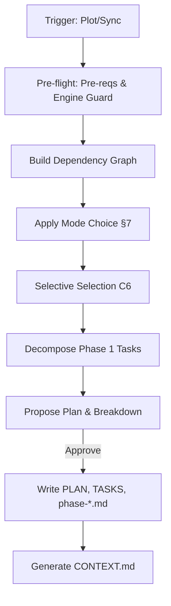

# Task Workflow

Generates `PLAN.md` (Phases) and `TASKS.md` (Atomic Tasks). Input: `.design/specifications/`.

## Argument Routing

Parse the `[arg]` to determine the planning mode:

| Input | Detection | Result |
| :--- | :--- | :--- |
| *(empty)* | No argument | **Full Planning**: Resolve workspace via §Workspace Resolution, then plan all specs |
| `engine` | Matches a workspace name in `workspace.json` | **Scoped Planning**: Plan only specs registered in that workspace's `INDEX.md` |
| `"decompose phase-2"` | Quoted text or text that does NOT match any workspace name | **Guided Planning**: Interpret text as planning directive (focus, instruction, filter) |
| `engine "only new specs"` | First token is workspace + remaining is quoted text | **Scoped + Guided**: Planning directive applied within workspace scope |

> **Workspace Fallback (Modes A, C)**: When no workspace is specified in the argument, resolve workspace via Core Invariant #1 (Zero-Prompt chain) before applying the planning directive. The directive text filters or guides planning but does not replace workspace resolution.
> **Disambiguation**: If the argument is a single unquoted word that matches both a workspace name and could be a directive keyword, workspace takes priority. To force directive interpretation, wrap in quotes: `/magic.task "engine"`.
> **Handoff Propagation**: When recommending `/magic.run` after planning, propagate the workspace context: `/magic.run {workspace}`.

## Core Invariants (Mandatory)

1. **Context (Zero-Prompt)**: Auto-resolve workspace: explicit CLI arg > `MAGIC_WORKSPACE` env var > `.design/workspace.json` `default` field > single-workspace auto-select > root `.design/` fallback. If multiple workspaces and no default → ask user. Never ask otherwise.
2. **Registry Integrity**: Read ALL specs in `INDEX.md` before planning. No exceptions.
3. **Auto-Init**: If `.design/` missing, auto-run `.magic/init.md`.
    - **Intent Preservation**: If `init.md` or `analyze.md` is sub-delegated during this workflow, memo the original user intent before delegating. After delegation resolves, resume explicitly: "Resuming: '{original intent}'." Intent MUST NOT be silently dropped across workflow boundaries.
4. **Logic Guards**:
    - **No Orphans**: Every registered spec must be in `PLAN.md` or `## Backlog`.
    - **Atomic Tasks (C10)**: Every spec in Phase 1+ must have a concise checklist in **`TASKS.md`** (Phase Checklist) with `T-XXXX` IDs.
    - **User Gate**: In **Trust Mode (C9)**, show the Plan & Checklist summary and ask for a single "Go" confirm. Full details remain in `.design/` for inspection but aren't forced on the user.
    - **Zero-Prompt handoff**: After approval, authorize skip-confirm for `magic.run`.
5. **Rules Parity**: Record current `RULES.md` version in `TASKS.md` header. Notify user of drift and re-sync during update.
6. **Engine Integrity (C14)**: If engine files (`.magic/`) modified → `node .magic/scripts/executor.js update-engine-meta --workflow task` (Smart History: redundant automated entries are skipped).
7. **Architectural Logic**:
    - **Circular Guard**: Deep scan `Related Specifications` across ALL levels. If ANY cycle (N-level) detected → **HALT**.
    - **Cycle Resolution**: Suggest breaking the chain by identifying the "weakest link" (Related Spec vs Implements).
    - **Layer Respect**: L1 (Concept) always scheduled BEFORE L2 (Implementation).
    - **Autonomous Selection (C6)**: **Default**: Auto-pull ALL `Stable` specs into the active `PLAN.md`. Move `Draft`/`RFC` to `## Backlog`. No user prompt required unless a priority conflict is detected.
    - **Actionable Outcome**: After planning, show: `[Auto-Plan] {N} specs added to Phase {X}, {M} moved to Backlog.`

## Workflow: Planning & Orchestration



### Steps

1. **Pre-flight**: `node .magic/scripts/executor.js check-prerequisites --json --require-specs`.
    - `checksums_mismatch` → **HALT**. Restore engine first.
    - **File-Header Parity**: For each spec in `INDEX.md`, read the actual file's `Status:` and `Version:` header fields. If either mismatches the corresponding `INDEX.md` entry → **HALT** with `STATUS_DRIFT` or `VERSION_DRIFT`. Report: "Header parity failure on `{file}`: file {field} `{file_val}` ≠ registry `{index_val}`. Resolve via `magic.spec` or `magic.analyze` before planning." This catches manual edits that bypassed the spec workflow.
    - **Cross-Workspace Parity**: If `workspace.json` registers >1 workspace, scan for identically-named spec files across workspaces. If any name collision with version mismatch is found → **HALT**. Report: "Source of Truth Drift: `{file}` exists in `{ws-a}` (v{X}) and `{ws-b}` (v{Y})." Options: (a) Sync from canonical source workspace, (b) Rename to unique name per workspace, (c) Force ignore (document reason).
2. **Analyze**: Extract `Related Specifications` and `Implementation Notes`.
3. **Draft Plan**: Group by Layer. Build full dependency matrix *before* task generation to detect N-level cycles.
4. **Execution Mode**: If not in `RULES.md §7`, ask (Sequential/Parallel) and save to §7.
5. **Decompose**: Split the active phase into 2-3 tasks per spec.
    - **IDs**: `T-{phase}{track}{seq}` (e.g., `T-1A01`).
    - **Tracks**: Group tasks by file independence.
    - **Testing (Mandatory)**: Every feature track MUST include at least one `Validation Task` (e.g., `T-1T01`) to verify implementation vs spec.
6. **Sync (Update Mode)**:
    - **C12 Quarantine**: If L1 parent is not `Stable` in `INDEX.md` (status already changed by `spec.md` C12 cascade) → Move L2 children to `## Backlog` in `PLAN.md`; mark their tasks `Blocked [!]` with reason: "L1 parent `{file}` is `{status}` (C12)". **Do NOT modify INDEX.md** — status changes are the responsibility of `spec.md` only. **C12.1 Stabilization Exception**: Tasks intended to stabilize or fix mismatches to regain `Stable` status may bypass quarantine.
    - **Phantom Specs**: If spec in PLAN/INDEX but missing from disk → Cancel `Todo` / `Pending`; archive `Done`. Block active tasks.
    - **Structural Refactor**: If sections merged or split, validate all `T-{ID}` mappings to §sections. Re-map in TASKS.md & phase files. **ID Splitting**: Keep original `T-{ID}` for the first sub-task; append `.N` suffixes (e.g., `T-1A01.1`, `T-1A01.2`) for others.
    - **Renames**: Global search-and-replace on filename changes (exclude archives).

### Plan Write-back

- Use `.magic/templates/plan.md` and `.magic/templates/tasks.md`.
- PLAN.md: Strategic overview (Phases & Specifications). No atomic checklist items.
- TASKS.md: Tactical execution ledger. Contains the Master Phase Checklist (with IDs) and detailed tasks.

## Task Completion Checklist

```
Task Workflow Checklist — {operation}
  ☐ All registered specs read; no orphans/phantoms left unaddressed
  ☐ Circular dependencies checked; layer order 1->2 respected
  ☐ Selective Planning (C6) and Quarantine (C12) applied
  ☐ Testing Track: Validation tasks (T-XXXX) included for all new features
  ☐ Rules Parity: Current RULES.md version recorded in TASKS.md; Task IDs valid
  ☐ PLAN.md (Strategic) / TASKS.md (Tactical) written; CONTEXT.md regenerated
  ☐ Engine Meta: C14 bump performed if .magic/ files modified
```
